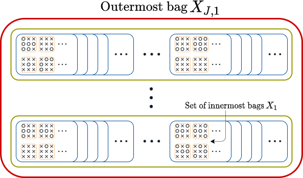

# Nested Multiple Instance Learning with Attention Mechanisms

This is the source code described in the paper "Nested Multiple Instance Learning with Attention Mechanisms" by Saul Fuster, Trygve Eftestøl and Kjersti Engan.

### 1 - Abstract
Multiple instance learning (MIL) is a type of weakly supervised learning where multiple instances of data with unknown labels are sorted into bags. Since knowledge about the individual instances is incomplete, labels are assigned to the bags containing the instances. While this method fits diverse applications were labelled data is scarce, it lacks depth for solving more complex scenarios where associations between sets of instances have to be made, like finding relevant regions of interest in an image or detecting events in a set of time-series signals. Nested MIL considers labelled bags within bags, where only the outermost bag is labelled and inner-bags and instances are represented as latent labels. In addition, we propose using an attention mechanism to add interpretability, providing awareness into the impact of each instance to the weak bag label. Experiments in classical image datasets show that our proposed model provides high accuracy performance as well as spotting relevant instances on image regions.

<p align="center">
    
</p>

<p align="center">
    
</p>

### 2 - How to use

The main file contains three different experiments to choose from, with two different datasets MNIST [[1]](#1) and PCAM [[2]](#2) (to use PCAM, please download the dataset from https://github.com/basveeling/pcam and place it in a folder as pcam_data). Both experiment number and dataset to use can be specified using the defined variables at the start of the script. Moreover, there is an architecture choice for a nested or not implementation, plus the use of attention.

### 3 - Link to paper
https://arxiv.org/abs/2111.00947

### 4 - How to cite our work
The code is released free of charge as open-source software under the GPL-3.0 License. Please cite our paper if you use it in your research.
```
@misc{fuster2021nested,
      title={Nested Multiple Instance Learning with Attention Mechanisms}, 
      author={Saul Fuster and Trygve Eftestøl and Kjersti Engan},
      year={2021},
      eprint={2111.00947},
      archivePrefix={arXiv},
      primaryClass={cs.LG}
}
```

### 5 - References
<a id="1">[1]</a> 
Y. LeCun, L. Bottou, Yoshua Bengio, and P. Haffner,“Gradient-based learning applied to document recognition,” Proceedings of the IEEE, vol. 86, pp. 2278–2324, 1998.

<a id="2">[2]</a>
Bastiaan S. Veeling, J. Linmans, Jim Winkens, T. Cohen, and M. Welling, “Rotation equivariant cnns for digital pathology,” ArXiv, vol. abs/1806.03962, 2018.
